# DeepSeek Harness

English | [中文](README.zh.md)

## About this fork

This is a personal fork of [deepseek-ai/deepseek-harness](https://github.com/deepseek-ai/deepseek-harness). Upstream is the source of truth for the project; this repository is not affiliated with DeepSeek AI and carries no support commitment.

**Why it exists.** The Web client shows a session's file work only where it happened — one diff card per `edit`/`write` tool row, plus the closing turn's produced-file chips. Reviewing what a session did to the workspace therefore means scrolling the whole transcript and rebuilding the per-file story by hand, and a long session buries the answer under hundreds of steps. Nothing showed which files the agent was touching right now, and nothing collected one file's repeated edits into one place.

**What it adds.** A session file rail beside the transcript listing what the session read and changed, plus an inline side-by-side diff — before on the left, after on the right, paired line by line — that opens by default and is governed by a General setting. Descendant subagent sessions are read through the durable child catalog and merged in, one row per file with each segment labelled by the agent, turn, and tool that made it. The design, its rejected alternatives, and its known limits are recorded in [the file panel Agent Note](.agents/notes/implemented/feature/2026-08-26-web-session-file-panel.md).

A `Files` control opens the rail at the head of the view tabs; a mutation row arrives with its change already open:

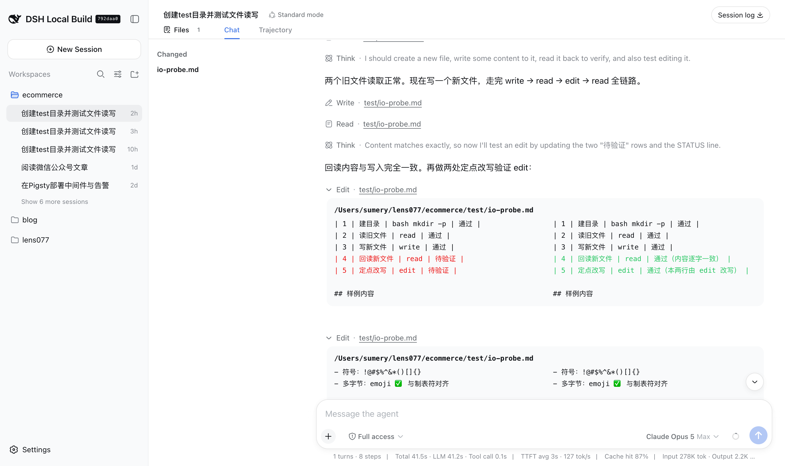

Expanding a produced file compares its content before and after — one segment per recorded change, labelled with the turn and tool that made it, so a file written once and edited twice reads as the three steps it was:

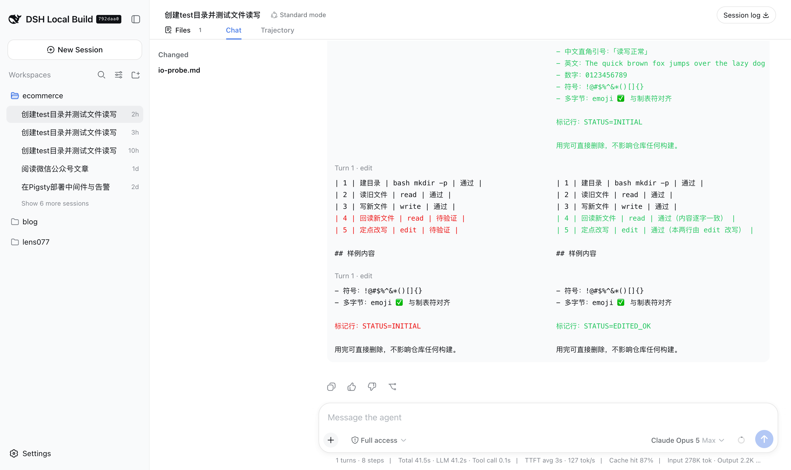

**Per-file line counts.** Every rail row states the size of its change beside the file name — added lines in green, removed in red, totalled across that file's recorded hunks. Merging a descendant session's changes recomputes the totals from the merged segments rather than carrying the pre-merge numbers forward.

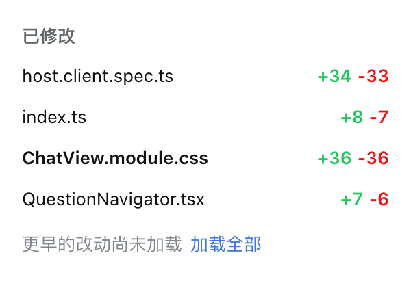

**Question navigation.** A long conversation buries its own questions, and paged history means a visible-only index would omit the earliest ones. The Chat view derives a question index from finalized `user` Chat Nodes and drives it from a sticky control stack that shares the composer-height anchor with the back-to-bottom button: adjacent navigation, a compact marker for the current question, and a searchable full list. A jump aligns the target row to the top, respects reduced-motion preferences, and highlights the row for two seconds; moving before the loaded head requests the next older page before resolving the target, so paging keeps one authority. The feature adds no session events and does not change model-visible history.

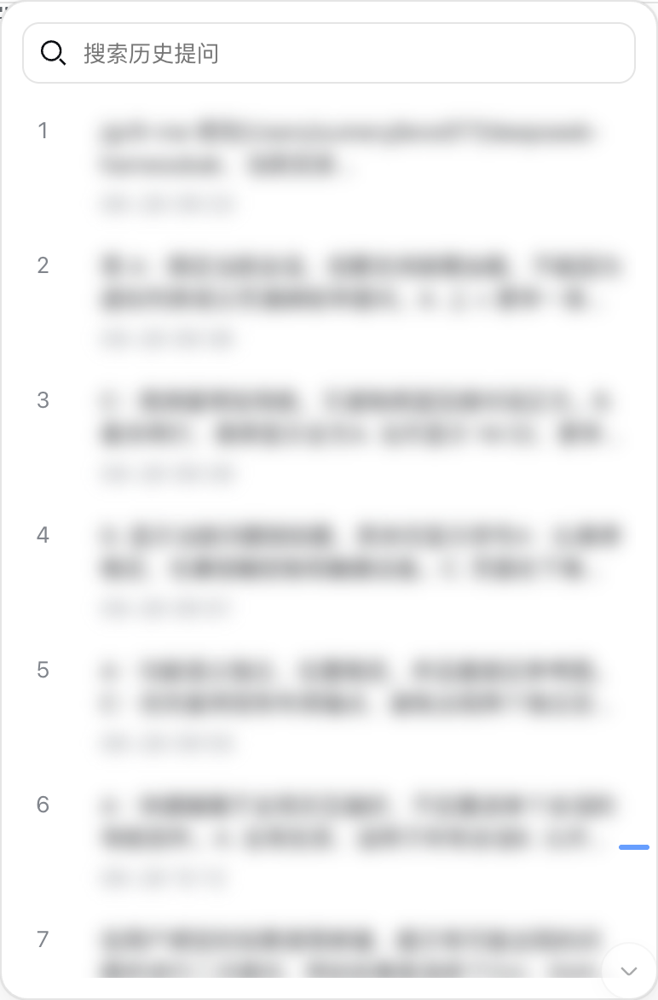

**Question shortcuts.** Navigation is bound to Command with the arrow keys on macOS and Control elsewhere. The General Settings row records arbitrary non-modifier keys, requires explicit confirmation for an unmodified single key, rejects a modifier alone, prevents a duplicate previous/next binding, and offers three focus policies; the default suppresses the shortcuts inside form controls and editable regions.

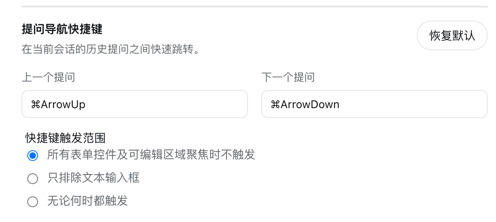

**Configurable Workspace session count.** A collapsed Workspace previously showed exactly five Sessions, which wastes height on a large display and hides too much context on a dense one. The count is now an integer from 5 through 20 or `auto`, still defaulting to five, and is reachable from both the Workspace view-options menu and General Settings. Automatic sizing observes the grouped tree height and estimates a per-group row budget after group-header chrome, clamped to the same range. Explicitly expanded groups still show every Session, and flat-list mode ignores the preference because it has no per-Workspace collapse control.

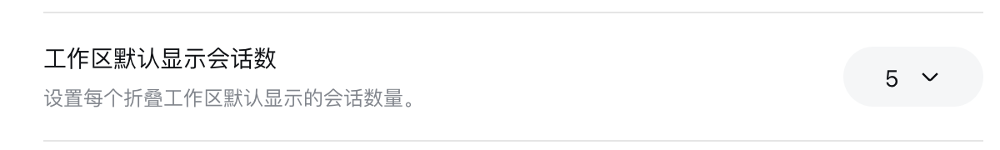

**Session range and multi-selection.** Workspace Session rows had no selection of their own: a click meant "open", and the only highlighted row was the opened Session. Rows now support Windows-Explorer-style selection, enabled by default and switchable in General Settings. `Ctrl`+click (`Cmd` on macOS, where `Ctrl`+click is the system secondary click) toggles one row, `Shift`+click takes the inclusive range from the anchor, and `Ctrl`+`Shift`+click unions a further range onto it; no modified gesture opens a Session or starts a reorder drag. With the list focused, `Ctrl`/`Cmd`+`A` selects every visible row, `Escape` clears, the arrow keys move the lead, and `Shift`+arrow extends. Ranges run over the rows actually rendered, so they cross Workspace groups but never reach a collapsed group or a row behind the **Show more** cut. The selection is browser-local and deliberately not persisted, because the viewing store persists whole-value and a restored selection would highlight rows nobody picked. The design and its rejected alternatives are recorded in [the multi-selection Agent Note](.agents/notes/implemented/architecture/2026-08-31-workspace-session-multi-selection.md).

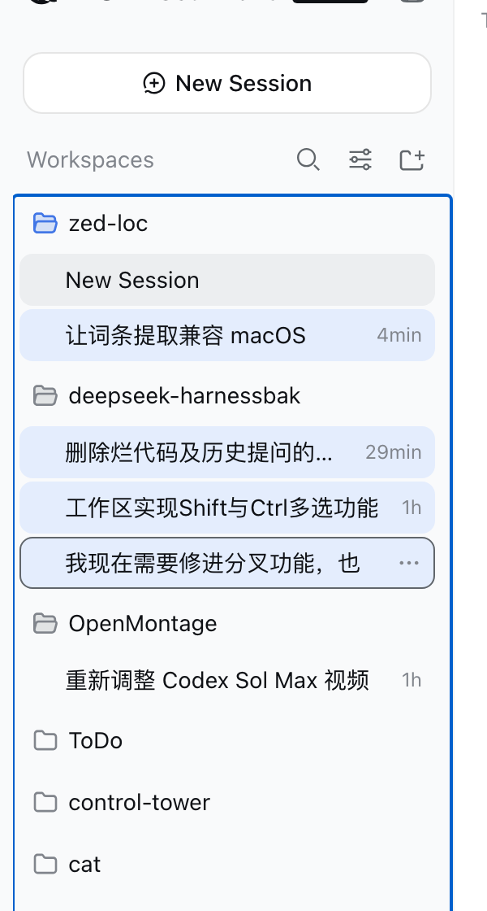

**Terminal readiness.** The backend spawned bash with `PS1='dsh> '` and gated its fast settle on seeing that exact text, while the persistent-bash tool reassigned `PS1` to its own collision-resistant marker after startup — so the prompt was never matched and every command fell back to silence-based settling. Linux hid the cost behind its exact stdin probe; on macOS `isStdinWaiting` is a stub returning `false`, so every command there paid `idleSilenceMs + handoffGraceMs`. The prompt is now a per-session value that the spawn request declares, and a blank or multi-line prompt is rejected because neither can be matched against terminal output. Measured against a real bash PTY on darwin: 3506 ms per command before, 56 ms after.

**Delegated child session ids.** A subagent tool call now records the child session it spawned. Nothing else in the parent log identifies it — a Session summary carries only `parentSessionId` — so without it a call and its child cannot be related after the fact. No client reads it yet — the file rail still reaches descendants through the child catalog — but it removes the one blocker that kept a descendant's diff from being drawn under the call that delegated it.

**Deleting a session you have opened.** Permanent deletion retires a live Session only through the exact Agent handle the gateway owns. The shared Agent resolver that generic verbs use — history, models, prompt — resumed a cold session but kept only the Agent and dropped its handle, so every session opened from the sidebar was live yet undisposable, and its deletion failed with `agent-busy` naming the session as its own blocker, on that attempt and every later one. The resolver now hands each resumed handle to the owning gateway, and a lifecycle that ends on its own releases its handle on `agent/disposed`. Opening a session and then deleting it works:

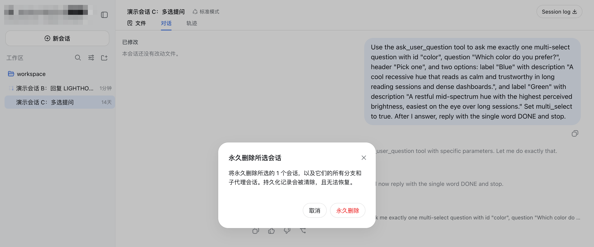

**Batch deletion survives one rejection.** Selected roots were deleted in sequence and the first failure aborted the rest, stranding every later session behind an unrelated error. Each root now runs independently; the dialog reports the first reason and keeps only the still-undeleted roots selected for a retry. Here an idle session and a running one were selected together: the idle one is gone, the running one refuses with `agent-busy` and stays selected.

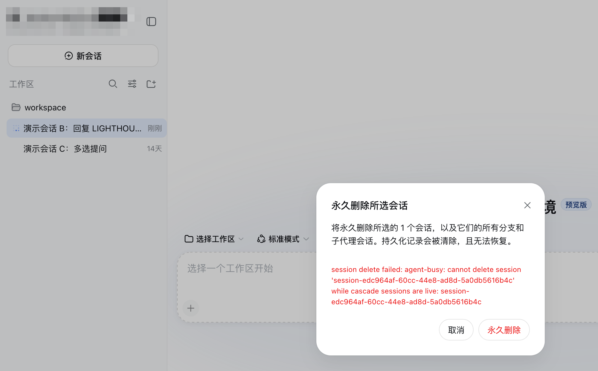

**Vision and reasoning for hand-entered models.** A model added on the Models page — a release newer than the installed pi-ai catalog, or one on a company gateway — was text-only and non-reasoning until `settings.yaml` said otherwise: pasting an image fell back to a file reference, and the model picker offered no thinking levels. The row's **Advanced** fold now edits both alongside the capacities. **Image input** chooses between the catalog default, text and images, and text only; **Reasoning** chooses between the catalog default, a non-reasoning model, and a checked set of pi-ai's seven levels, each written under its canonical wire spelling. Hand-written values the controls cannot express are shown as such and preserved, a dict that offers no level besides `off` is refused before any write, and a renamed spelling or `compat` switch still lives in `settings.yaml`. Details in [Configure models](docs/user/guide/providers.md#image-input).

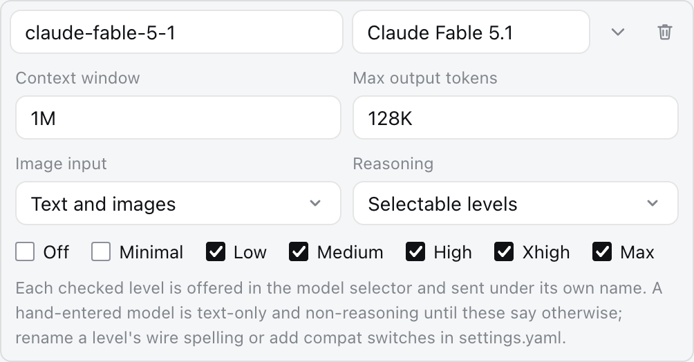

In context, on a custom provider's editor card — the fold sits under the row it configures, so the model, its capacities, and its capability claims are read and saved together:

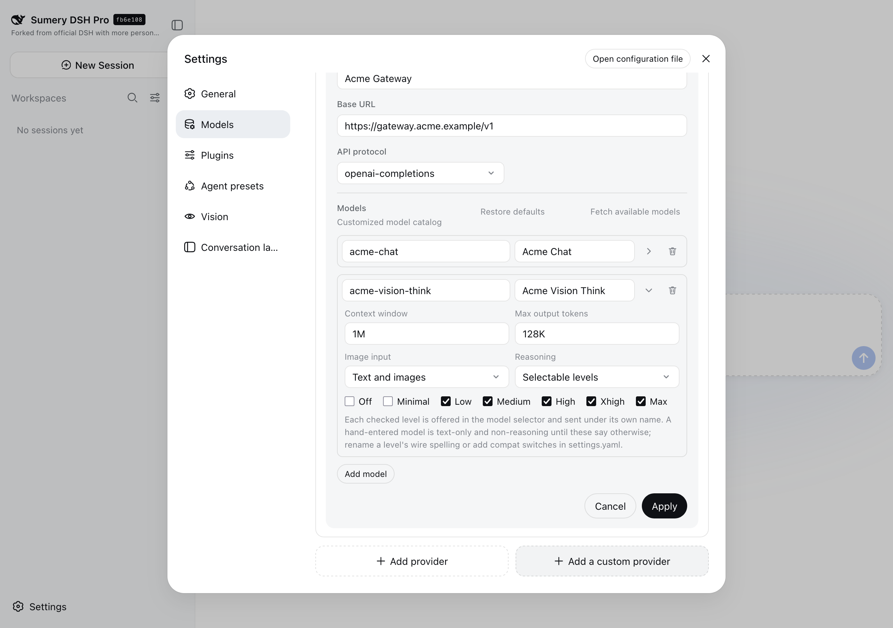

**Settings section glyphs.** Every section a plugin contributes to Settings used to share the General gear, so the vision bundle's page and Conversation layout were told apart by label alone. The shell now maps its known section ids to their own glyph — an eye for `vision-toolkit`, a side panel for `conversation-layout` — and keeps the gear for ids it does not know.

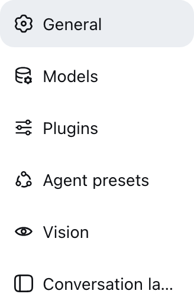

**A durable inbox instead of a green dot.** Work left running overnight across several workspaces left no record the next morning: the sidebar's "finished" dot was a browser-memory bit that cleared on click or refresh, and a session blocked on an approval waited unnoticed. The **汇总** entry under New Session now carries the number of sessions that need you and opens an inbox over the center column. Rows are sectioned by why they need attention — waiting for your reply, failed or interrupted, finished but unread, seen but not handled, running — with a time window that defaults to "since you last reviewed", workspace chips with per-workspace counts, and card actions to open, continue with a prefilled composer, mark handled, add a todo, pin, or snooze until tomorrow. `Ctrl+1` opens and closes the panel from anywhere, including mid-sentence in the composer, and the card actions ride a keyboard ring (`j`/`k`, `Enter`, `e`, `t`, `p`, `s`); "copy brief" puts the sections on the clipboard as Markdown. Every mark lives on the Host — which reply you saw, what you handled, what is snoozed or pinned — so it survives refresh, another browser, and a restart, and the number also prefixes the browser tab title.

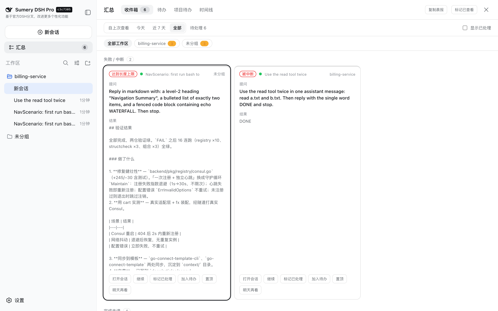

**Todos that point back at the conversation.** A todo is a Host record addressed to a session and, optionally, to one question inside it. Add one from a card, from the right-click menu on any session row, or from the todo tab's input; open it with "jump to that question", which scrolls the transcript to the exact question, paging back through history when it is not loaded yet, or with "continue", which opens the session with a continuation line in the composer. Sessions whose last turn did not finish appear as automatic todos until you mark them handled.

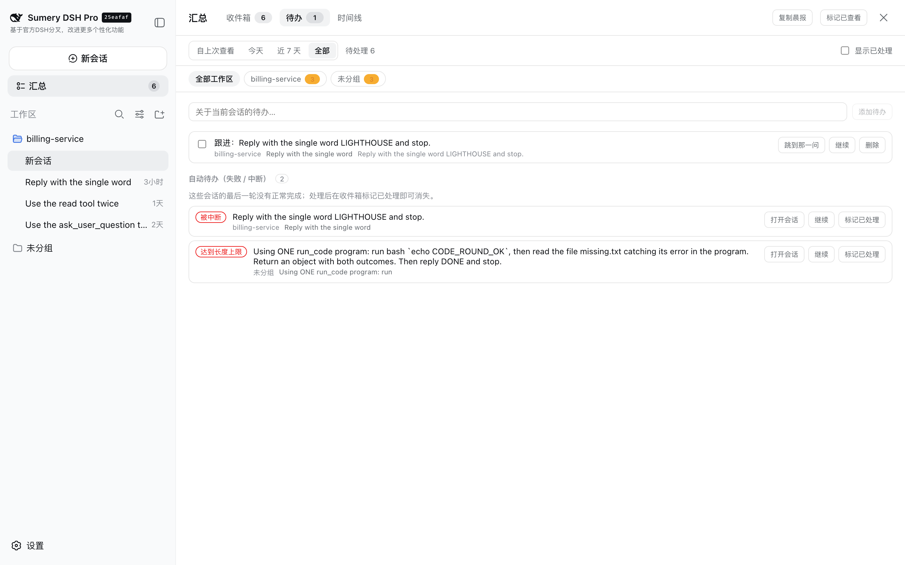

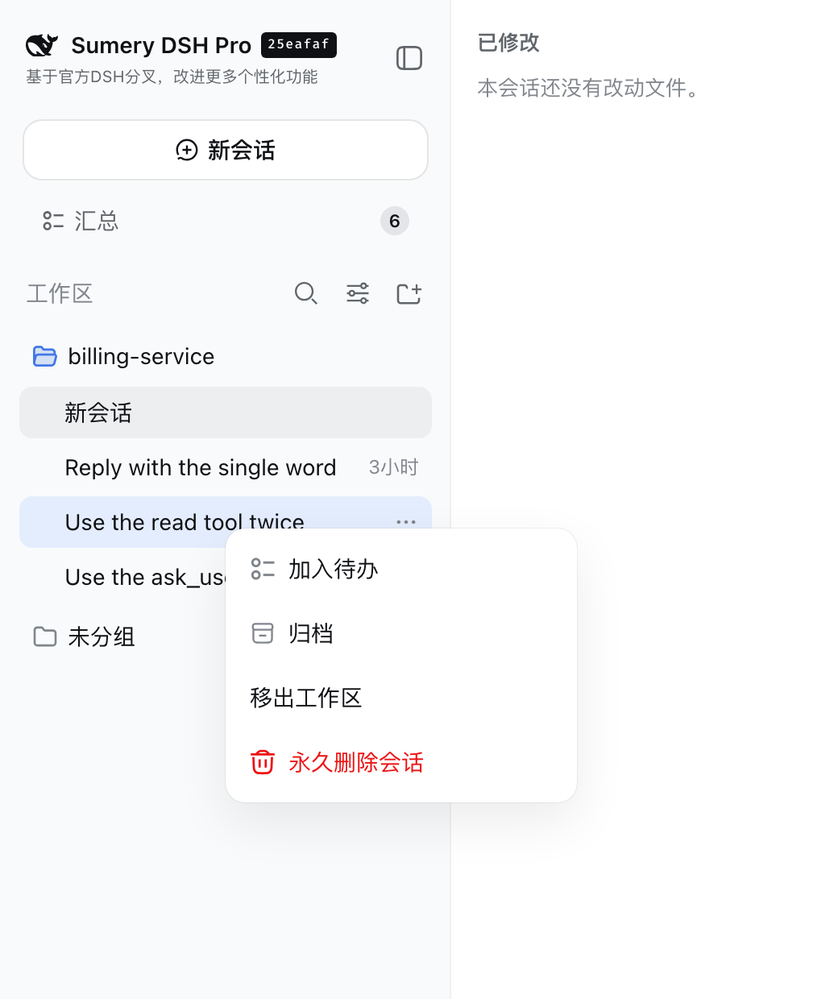

**A per-question timeline.** The digest projection now retains each session's earlier questions with their outcome and changed-file count, so the timeline tab places every question on the day it was asked — a session worked on three days appears on three days — and a row opens the session at that question.

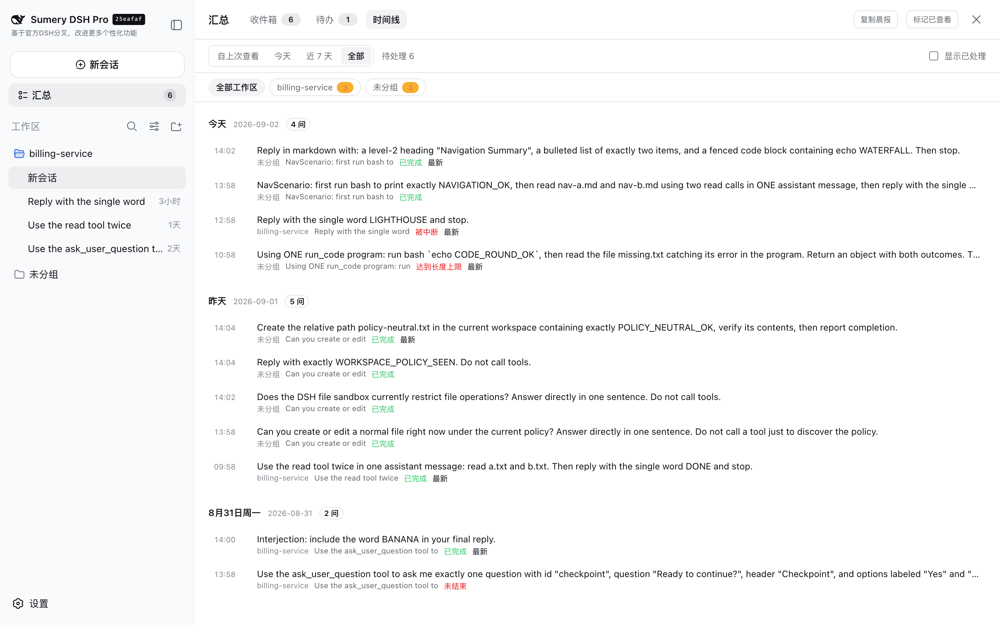

**How the screenshots are made.** Every picture above is a real screen from this fork's own build, never a mock-up. To keep personal sessions and keys out of them, a second `dsh web` is started from the checkout's source against an isolated home (`DSH_HOME=/private/tmp/dsh-demo-home`, port 3099): its profile lists only the base bundle, the web app, and the vision bundle, and its `settings.yaml` declares a fictitious `acme-gateway` provider with an `acme-vision-think` model — no API key, no sessions, no workspace. The inbox pictures come from the same kind of isolated server, this time launched through the repository's own web test scaffold: six sessions are seeded from the e2e fixture logs under `apps/web/tests/snapshots/`, parsed with the repository's `parseSessionLog` and persisted through the real JSONL backend, two of them with their final `turn/end` rewritten to `interrupted` and `max-tokens` so the failed section has rows; Playwright at device scale 2 in `zh-CN` then adds a todo from a card, pins a row, switches tabs, and right-clicks a session row, and every picture is the screen at that moment. Playwright drives Firefox at device scale 2 in the light theme, once per language, and clicks through the same path a user would: Settings → Models → Edit → Customized settings → Advanced. The Models-page pictures were then verified as a round trip rather than a rendering: checking two more levels and saving through the card rewrote the isolated `settings.yaml` with `off: null` and `minimal: minimal`, and the server's `llm.models` reply listed all seven levels for that model. The fixture provider and the fork's own product chrome are the only content, so nothing needs masking; the demo server, browser sessions, home directory, and temporary files are removed afterwards, and the personal `~/.dsh` and port 3080 are never touched. Any regression in the pictured behavior shows up in `pnpm run test:gui` (the component and shell suites) and in `DSH_SNAPSHOT=replay pnpm run test:web` (the assembled browser).

**Repository.** This fork lives at [github.com/lens077/deepseek-harness](https://github.com/lens077/deepseek-harness); its `main` tracks upstream `main` and adds the features above on top. File problems with the fork's additions as issues on the fork; upstream behavior, releases, plugin discovery, and the Discord community remain upstream's, linked below. Everything here — upstream code and the fork's additions alike — is under the [MIT license](LICENSE), and third-party licenses are disclosed in [THIRD_PARTY_NOTICES.md](THIRD_PARTY_NOTICES.md).

**Status.** A work in progress that tracks upstream. Branches here may contain unfinished work from several parallel efforts; nothing is promised stable, and changes are not upstreamed automatically. The MIT license and every upstream notice are inherited unchanged — see [LICENSE](LICENSE).

---

DeepSeek Harness (`dsh`) is an open-source agent harness developed by [DeepSeek AI](https://deepseek.com).

It uses an architecture where **everything is a plugin**, and is powered by [Cordis](https://github.com/cordiverse/cordis), whose design is described in [_A Programming Paradigm for Spatiotemporal Composability_](https://github.com/cordiverse/paper).

## Developer preview

DeepSeek Harness is currently in _developer preview_ and is iterating rapidly. **THERE WILL BE COMPATIBILITY-BREAKING CHANGES.**

## Run

### Run from `npm`

Install `Node.js`, then run:

```sh
npx @deepseek-ai/dsh web
```

The command starts the Web UI at `http://127.0.0.1:3080` by default and opens it in the default browser for a local launch. An SSH launch only prints the host URL because the SSH client or editor owns the local forwarded address. Pass `--no-open` to run the server without opening a browser. See [Web UI guide](docs/user/guide/index.md).

### Run from source

Clone this fork, not upstream: its `main` is the state the features above were built and verified on, and it is rebased onto upstream regularly, so a fresh clone of it is the safest working checkout.

```sh
git clone https://github.com/lens077/deepseek-harness.git
cd deepseek-harness
pnpm install
pnpm run build
pnpm dsh web
```

`pnpm run build` prepares the repository artifacts. `pnpm dsh web` uses those built artifacts without rebuilding.

Upstream publishes on its own schedule, so this fork may trail it by a few commits. To run the newest upstream code together with the fork's additions, start from upstream and merge the fork on top; a conflict here means the fork has not caught up with that upstream change yet, and the fork's `main` on its own remains the verified fallback.

```sh
git clone https://github.com/deepseek-ai/deepseek-harness.git
cd deepseek-harness
git remote add fork https://github.com/lens077/deepseek-harness.git
git fetch fork
git merge fork/main
pnpm install
pnpm run build
pnpm dsh web
```

## Community and support

- Feel free to submit feedback or bug reports through [GitHub Discussions](https://github.com/deepseek-ai/deepseek-harness/discussions).
- Add the [`dsh-plugin`](https://github.com/topics/dsh-plugin) topic to your plugin repository for discoverability.
- Join <a href="https://discord.gg/Ycq5dCaS4">DeepSeek Harness Discord community</a>.

## Contributing

See [CONTRIBUTING.md](CONTRIBUTING.md).

## Development

Start with the [development guide](docs/development.md) and [architecture documentation](docs/architecture.md).

For agents, follow [AGENTS.md](AGENTS.md).

## License

[MIT](LICENSE) — the upstream license, which this fork's additions inherit unchanged.

Third-party dependencies and their licenses are disclosed in [THIRD_PARTY_NOTICES.md](THIRD_PARTY_NOTICES.md).
