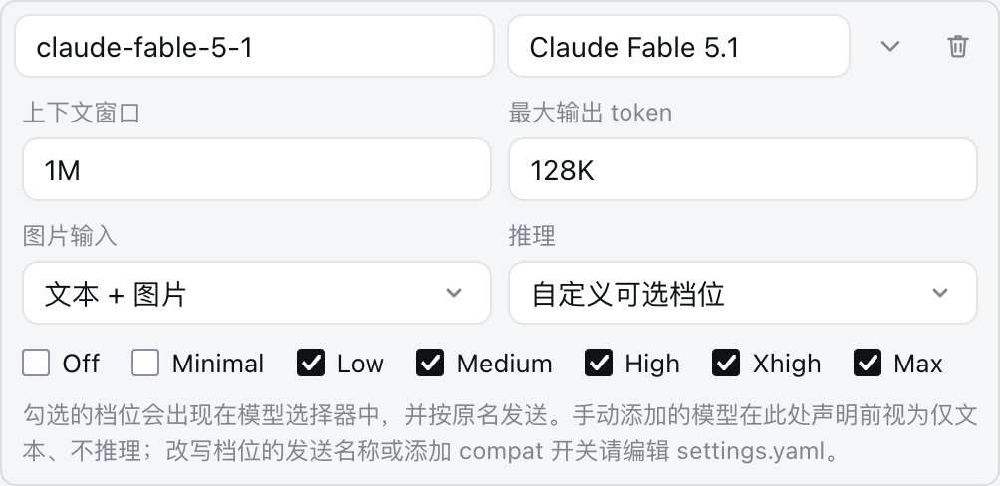
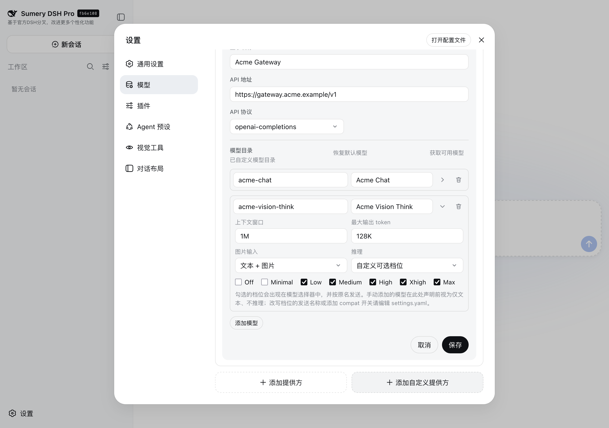
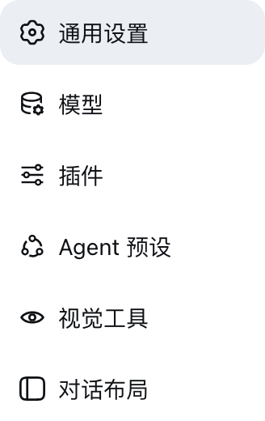

# DeepSeek Harness

[English](README.md) | 中文

## 关于这个 fork

这是 [deepseek-ai/deepseek-harness](https://github.com/deepseek-ai/deepseek-harness) 的个人 fork。上游是该项目的真相源；本仓库与 DeepSeek AI 无关联，也不承诺任何支持。

**为什么存在。** Web 客户端只在文件改动发生的地方展示它——`edit`/`write` 工具行各自一张 diff 卡片，外加收尾回合的产出文件 chips。于是要审查一个会话对工作区做了什么，就得滚完整条转录并在脑子里按文件重建过程，而长会话会把答案埋在几百步之下。此前没有任何地方显示 agent 此刻正在动哪些文件，也没有任何地方把同一个文件的多次修改收拢到一处。

**它加了什么。** 转录区旁边一条会话文件侧栏，列出本会话读过和改过的文件；以及一份内联左右对照 diff——左为修改前、右为修改后，逐行配对——默认展开，并由「通用」设置里的一项控制。后代子代理会话经持久化的子会话目录读取并合并进来，每个文件一行，每段标注做出该改动的 agent、轮次与工具。设计本身、被否决的替代方案与已知限制记录在[文件面板 Agent Note](.agents/notes/implemented/feature/2026-08-26-web-session-file-panel.zh.md)。

视图标签行首的 `Files` 控件打开侧栏；改写行出现时其改动已经展开：


展开一个产出文件即可对比它修改前后的内容——每次记录的改动一段，标注做出该改动的轮次与工具，于是一个「写一次、改两次」的文件读起来就是这三步：


**按文件的行数统计。** 侧栏每一行都在文件名旁写明这次改动的规模——新增行为绿色、删除行为红色，按该文件已记录的 hunk 汇总。合并后代会话的改动时，总数由合并后的片段重新计算，而不是把合并前的数字直接沿用过来。


**提问导航。** 长会话会把自己的提问埋掉，而分页历史意味着「只索引可见部分」会漏掉最早的那些提问。于是 Chat 视图从已定稿的 `user` Chat Node 推导出一份提问索引，并由一组粘性控件驱动它——这组控件与回到底部按钮共用同一个基于输入框高度的锚点：相邻跳转、当前提问的紧凑标记，以及一份可搜索的完整列表。跳转会把目标行对齐到顶部，尊重「减少动态效果」偏好，并把该行高亮两秒；若要跳到已加载头部之前，会先请求上一页再定位目标，于是分页仍只有一个权威来源。该特性不新增任何会话事件，也不改变模型可见的历史。


**提问快捷键。** 导航在 macOS 上绑定 Command 加方向键，其他平台绑定 Control。「通用」设置里的这一行可以录制任意非修饰键，对不带修饰键的单键要求显式确认，拒绝只按修饰键，阻止上一个/下一个绑定重复，并提供三种触发范围策略；默认策略在表单控件与可编辑区域内不触发快捷键。


**可配置的工作区会话数。** 折叠的工作区此前固定显示五个会话，这在大屏上浪费高度，在密集侧栏上又藏掉太多上下文。现在这个数量是 5 到 20 的整数或 `auto`，默认仍是五，且工作区视图选项菜单与「通用」设置两处都能改。自适应会观测分组树的高度，扣掉分组标题的装饰后估算每组的行数预算，并夹紧到同一区间。显式展开的分组仍然显示全部会话；单列表模式忽略这项偏好，因为它没有按工作区折叠的控件。


**终端就绪判定。** 后端以 `PS1='dsh> '` 拉起 bash，并把快速判定就绪的条件设为看到这段文本，而常驻 bash 工具在启动后又把 `PS1` 改成了自己那个抗冲突的标记——于是提示符永远匹配不上，每条命令都退回到按静默时长判定。Linux 靠精确的 stdin 探测掩盖了这份代价；而在 macOS 上 `isStdinWaiting` 是个恒返回 `false` 的桩，于是那里每条命令都要付 `idleSilenceMs + handoffGraceMs`。现在提示符是每个会话各自的值、由 spawn 请求声明，并拒绝空提示符与多行提示符，因为这两者都无法与终端输出匹配。在 darwin 上对真实 bash PTY 实测：改动前每条命令 3506 毫秒，改动后 56 毫秒。

**被委派的子会话 id。** subagent 工具调用现在会记录它派生出的子会话。父会话日志里没有别的东西能标识它——Session 摘要只带 `parentSessionId`——所以没有这条记录，调用与其子会话事后就关联不起来。目前还没有客户端读取它——文件侧栏仍经子会话目录触达后代——但它解除了「把后代的 diff 画在派生它的那次调用之下」的唯一阻塞。

**删除打开过的会话。** 永久删除只能通过网关自己持有的准确 Agent handle 退役实时 Session。通用动词（history、models、prompt）共用的 Agent 解析器在恢复冷会话时只留下 Agent、丢掉了 handle，于是从侧边栏打开过的每个会话都实时却无法释放，删除会以 `agent-busy` 失败，错误里把该会话列为阻塞它自己的对象，而且此后每次重试都一样。现在解析器会把每个恢复出的 handle 交给拥有它的网关，自行结束的生命周期则在 `agent/disposed` 时释放 handle。打开一个会话再删除它可以正常完成：


**批量删除不再被单个失败拖垮。** 所选的各个根按顺序删除，此前首个失败会中止其余全部，让后面的会话被无关错误卡住。现在每个根独立执行；弹窗报告首个失败原因，只把仍未删除的根保留在选中状态以便重试。下图同时选中了一个空闲会话和一个运行中的会话：空闲的已被删除，运行中的以 `agent-busy` 拒绝并保持选中。


**手动录入模型的视觉与推理能力。** 在模型页手动添加的模型——比已安装 pi-ai 目录更新的版本，或公司网关上的模型——在 `settings.yaml` 另行声明之前一律是纯文本、不推理的：粘贴图片会退化成一个文件引用，模型选择器也不提供任何思考档位。现在该行的**高级**折叠把两者与容量放在一起编辑。**图片输入**在跟随目录默认、文本 + 图片、仅文本之间选择；**推理**在跟随目录默认、不推理、以及勾选 pi-ai 七个档位的自定义集合之间选择，每个档位按规范的发送名称写入。控件无法表达的手写值会如实显示并保留，只剩 `off` 的字典在写入前即被拒绝，改写发送名称与 `compat` 开关仍留在 `settings.yaml` 中。详见[配置模型](docs/user/guide/providers.zh.md#image-input)。



放回自定义提供方的编辑卡片里看：折叠就在它所配置的那一行下面，模型、容量与能力声明一起读取、一起保存：



**设置分区图标。** 插件贡献到设置面板的每个分区此前都共用"通用设置"的齿轮，视觉工具箱页与对话布局只能靠文字区分。外壳现在把已知分区 id 映射到各自的图标——`vision-toolkit` 是眼睛，`conversation-layout` 是侧栏面板——未知 id 仍沿用齿轮。



**用持久的收件箱取代绿点。** 跨几个工作区跑了一夜的任务，第二天早上没有任何记录：侧边栏的"已完成"小圆点只是浏览器内存里的一个位，点一下或刷新就没了，卡在审批上的会话也无人察觉。「新会话」下方的 **汇总** 入口现在携带需要你处理的会话数，并在中间栏打开一个收件箱。行按需要关注的原因分区——等你回复、失败或中断、完成但未读、已读未处理、运行中——时间窗默认为"自上次查看"，工作区 chip 带各自的计数，卡片提供打开、带预填输入框的继续、标记已处理、加入待办、置顶、明天再看。`Ctrl+1` 可从任何位置开关面板，在输入框里打到一半也能用；卡片操作则在键盘环上（`j`/`k`、`Enter`、`e`、`t`、`p`、`s`）；"复制晨报"把各分区以 Markdown 放进剪贴板。每个标记都存在 Host 上——看过哪条回复、处理了什么、延后或置顶了什么——因此刷新、换浏览器、重启都还在，这个数字也会前缀到浏览器标签页标题。


**指回对话的待办。** 待办是 Host 上的一条记录，指向一个会话，并可选地指向其中某一问。可以从卡片、从任意会话行的右键菜单、或从待办标签的输入框添加；用"跳到那一问"打开时对话会滚到那条提问，历史尚未加载时会向前翻页；用"继续"打开时会在输入框预填一行接续语。最后一轮没有正常完成的会话会作为自动待办出现，直到你标记已处理。


**按提问的时间线。** 汇总投影现在保留每个会话更早的提问及其结果和改动文件数，因此时间线标签把每一问放在它被提出的那一天——一个会话做了三天就出现在三天里——点一行即可在那一问处打开会话。


**截图是怎么拍的。** 上面每一张图都是这个 fork 自己构建出来的真实界面，不是效果图。为了不把个人会话和密钥拍进去，会从 checkout 的源码另起一个 `dsh web`，指向一个隔离的家目录（`DSH_HOME=/private/tmp/dsh-demo-home`，3099 端口）：它的 profile 只列出基础 bundle、Web 应用和视觉 bundle，`settings.yaml` 只声明一个虚构的 `acme-gateway` 提供方和一个 `acme-vision-think` 模型——没有 API 密钥、没有会话、没有工作区。收件箱的几张图来自同类的隔离服务，这次通过仓库自己的 Web 测试脚手架启动：用 `apps/web/tests/snapshots/` 下的 e2e fixture 日志播种六个会话，经仓库的 `parseSessionLog` 解析后通过真实的 JSONL 后端持久化，其中两个把最后的 `turn/end` 改写为 `interrupted` 与 `max-tokens`，以便失败分区有内容；随后 Playwright 以设备缩放 2、`zh-CN` 从卡片加入一条待办、置顶一行、切换标签、右键一个会话行，每张图都是当时的真实画面。Playwright 以设备缩放 2、浅色主题驱动 Firefox，每种语言各跑一遍，并沿用户真实的路径点击：设置 → 模型 → 编辑 → 自定义设置 → 高级。模型页的图随后按一次往返而非一次渲染来核验：再勾选两个档位并通过卡片保存，隔离的 `settings.yaml` 被改写为带 `off: null` 与 `minimal: minimal`，服务端 `llm.models` 的回复也为该模型列出了全部七个档位。画面里只有虚构提供方和 fork 自己的产品外壳，因此无需打码；演示服务、浏览器会话、家目录和临时文件事后全部删除，个人的 `~/.dsh` 与 3080 端口自始至终不被触碰。图中行为一旦回退，会在 `pnpm run test:gui`（组件与外壳测试）和 `DSH_SNAPSHOT=replay pnpm run test:web`（组装后的浏览器）中暴露。

**仓库。** 这个 fork 位于 [github.com/lens077/deepseek-harness](https://github.com/lens077/deepseek-harness)；其 `main` 跟随上游 `main`，并在其上叠加上述功能。fork 新增部分的问题请提到 fork 的 issues；上游行为、发布、插件发现与 Discord 社区仍归上游，见下文链接。这里的一切——上游代码与 fork 的新增——都采用 [MIT 许可证](LICENSE)，第三方许可证在 [THIRD_PARTY_NOTICES.md](THIRD_PARTY_NOTICES.md) 中披露。

**状态。** 跟随上游的进行中工作。这里的分支可能包含若干条并行工作的半成品；不承诺任何东西稳定，改动也不会自动回流上游。MIT 许可证与全部上游声明原样继承——见 [LICENSE](LICENSE)。

---

DeepSeek Harness（`dsh`）是由 [DeepSeek AI](https://deepseek.com) 开发的开源 agent harness（智能体框架）。

它采用**一切皆插件**的架构，并由 [Cordis](https://github.com/cordiverse/cordis) 驱动，其设计参见论文 [_A Programming Paradigm for Spatiotemporal Composability_](https://github.com/cordiverse/paper)。

## 开发者预览

DeepSeek Harness 目前处于 _开发者预览_ 阶段，正在快速迭代。**未来将出现破坏兼容性的变更。**

<a id="run"></a>

## 运行

### 通过 `npm` 运行

安装 `Node.js`，然后运行：

```sh
npx @deepseek-ai/dsh web
```

该命令默认会在 `http://127.0.0.1:3080` 启动 Web UI，本机启动时还会用默认浏览器打开页面。通过 SSH 启动时只打印宿主机 URL，因为本地转发地址由 SSH 客户端或编辑器持有。传入 `--no-open` 可仅运行服务器而不打开浏览器。详见 [Web UI 指南](docs/user/guide/index.zh.md)。

<a id="run-from-source"></a>

### 从源码运行

请克隆本 fork 而不是上游：它的 `main` 就是上面这些功能构建并验证过的状态，并且会定期跟进上游，所以直接克隆本仓库是最保险的可用状态。

```sh
git clone https://github.com/lens077/deepseek-harness.git
cd deepseek-harness
pnpm install
pnpm run build
pnpm dsh web
```

`pnpm run build` 会准备仓库产物。`pnpm dsh web` 会直接使用这些已构建产物，不会重新构建。

上游按自己的节奏发布，本 fork 可能落后几个提交。若想在最新的上游代码上使用本 fork 的新增功能，可以先拉取官方仓库，再把本 fork 合并上去；合并冲突意味着本 fork 尚未跟进那次上游改动，此时本 fork 自己的 `main` 仍是经过验证的兜底选择。

```sh
git clone https://github.com/deepseek-ai/deepseek-harness.git
cd deepseek-harness
git remote add fork https://github.com/lens077/deepseek-harness.git
git fetch fork
git merge fork/main
pnpm install
pnpm run build
pnpm dsh web
```

## 社区与支持

- 欢迎通过 [GitHub Discussions](https://github.com/deepseek-ai/deepseek-harness/discussions) 提交反馈或 bug 报告。
- 为你的插件仓库添加 [`dsh-plugin`](https://github.com/topics/dsh-plugin) 话题，便于被发现。
- 欢迎加入 DeepSeek Harness 企微群：扫码添加企微小助手并填写入群问卷，完成后小助手会邀请你入群。

<table>
  <thead>
    <tr>
      <th align="center">企微小助手</th>
      <th align="center">入群问卷</th>
      <th align="center">微信公众号</th>
    </tr>
  </thead>
  <tbody>
    <tr>
      <td align="center"></td>
      <td align="center"><a href="https://trtgsjkv6r.feishu.cn/share/base/form/shrcnIt5twSVdLGD52KJBckGCgg"></a></td>
      <td align="center"></td>
    </tr>
  </tbody>
</table>

## 参与贡献

参见 [CONTRIBUTING.md](CONTRIBUTING.zh.md)。

## 开发

请先阅读[开发指南](docs/development.zh.md)与[架构文档](docs/architecture.zh.md)。

面向 agent：请遵循 [AGENTS.md](AGENTS.md)。

## 许可证

[MIT](LICENSE)——即上游的许可证，这个 fork 的新增部分原样继承。

第三方依赖及其许可证见 [THIRD_PARTY_NOTICES.md](THIRD_PARTY_NOTICES.md)。
